# Final-presentation-portfolio

# Intoduction:
Hello everyone, My name is Jason, i am presenting this portfolio for the final project. Within this presentation, I've highlighted some of the completed assignments and exercises that I've worked on throughout this course. Additionally, I've added a resume that explains not only how the scripts function and how does how serve us, all the following scripts are found in my Github page 

# I)Cluster Linux diagnostic command

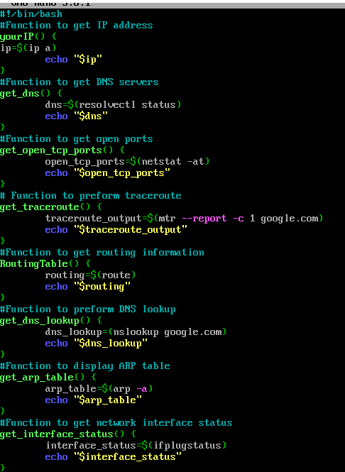
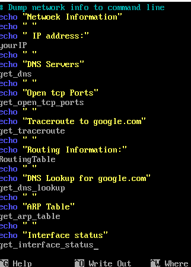
# script explanation:
this script works by using multiple networking diagnostic commands function and store them each into a given variable.
We activate each command by running echo request to the variable we obtain the current results in the picture bellow. 
This script serves as a multiple command launcher aiding the user to diagnose the machine connectivity to the internet network
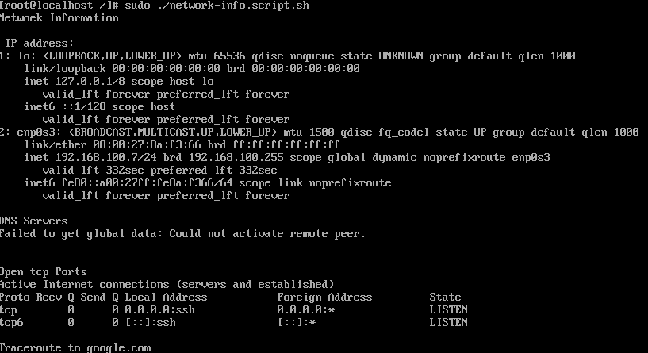
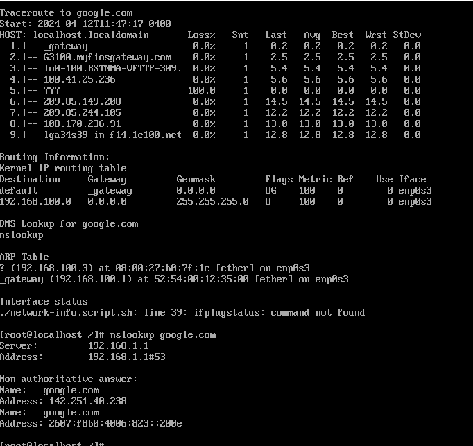

# II)Linux firewall security rules
# script explanation:
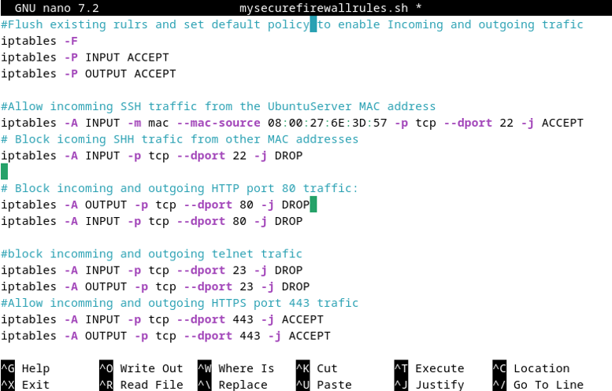
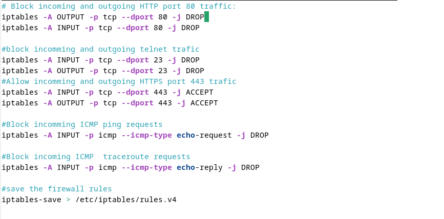
we have constructed a script that offers detailed instructions on how we want our machine firewall to function.
1-In this script, we secure our SSH traffic but allow SHH connection from a specific computer MAC address.
3-Because HTTP protocol is insecure, we block HTTP incoming and outgoing traffic protecting our machine communication to the web
4-Blocking The Telnet traffic protocol is highly recommended because Telnet lacks encryption and authentication mechanisms, leaving it vulnerable due to its older design. 
5-To protect our machine from D- DOS attack we decided to block incoming  ICMP ping echo and  trace route request 
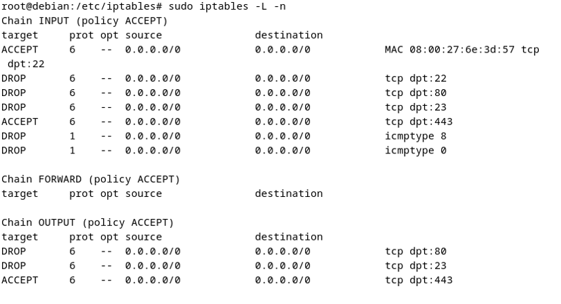
after launching the script we can the iptables rules has been updated according to our specification

# III)script for monitoring hidden files on home, and all files in root directory using GIT Function
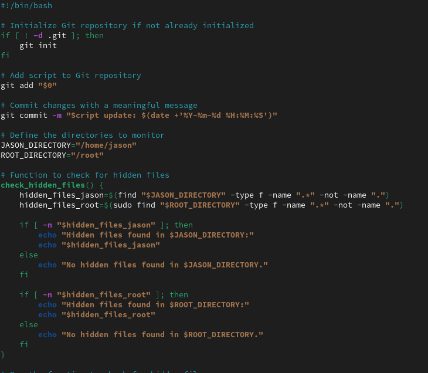

This script keeps an eye on hidden files in two specific directories “/home” and “/root”. It looks for files whose names start with a dot (.), which are usually hidden. It also uses Git, a version control system, to track changes to the script itself. Each time the script runs, it adds itself to the Git records, making it easy to see when it was last checked. This helps in staying aware of any changes over time. Running the script regularly ensures ongoing monitoring of hidden files and maintains a log of any script updates.
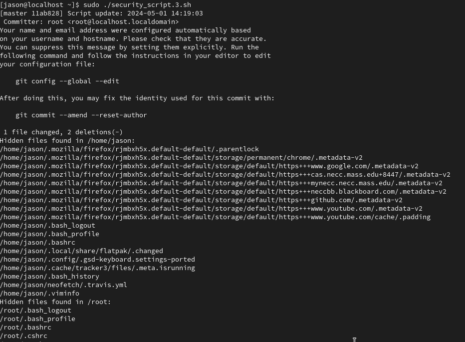

The output reveals significant updates and discoveries. Firstly, it indicates modifications made to a script file named "security_script.3.sh", with added new lines added, marking changes to its functionality. Additionally, hidden files have been unearthed within the "/home/jason" and "/root" directories, hinting at the presence of concealed data. These findings underscore the importance of vigilant monitoring and maintenance to ensure the security and integrity of system files and directories.

# IV) A script to backup your most important information and your logs. 
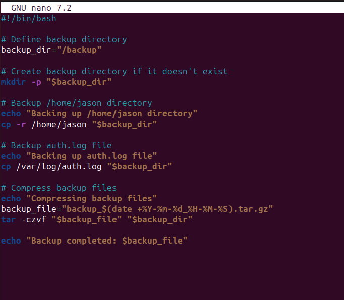
The program bellow automates saving important info and logs on a Linux system. First, it sets a variable called backup_dir for the storage spot, making the spot if it's not there. Then, it saves the /home/jason folder and the secure log at /var/log/auth.log. It tells the user about the process via terminal messages. After that, it puts all these files into a single archive and makes the name based on the date and time. It uses the tar command to make an archive and then compresses it using gzip. Lastly, it prints a message in the terminal, showing the name of the backup so it's easy to find and use.
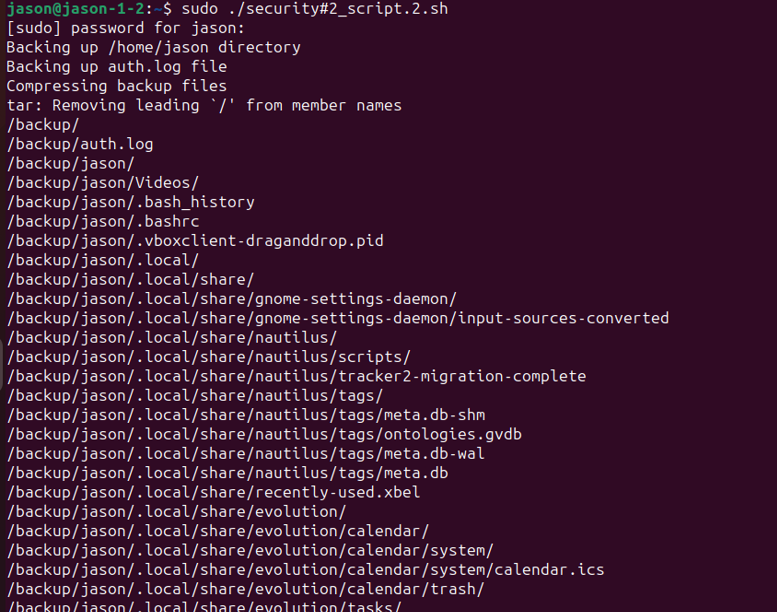
the obtained results are displayed into the crearted backup foler in the “/backup” directory
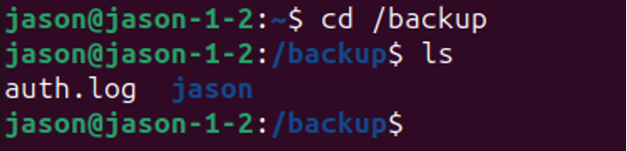
in the home directory we see that a compressed “backup.tar.gz” file has been created and in the compressed file contain the data of our “home/jason” and  “/etc/var/auth.log” directories
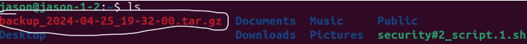
